# AC Control System

A distributed home automation system for controlling an AC unit via an nRF24L01+ mesh network. A Raspberry Pi acts as the central controller, coordinating Arduino nodes that handle relay switching and temperature monitoring.

## Hardware

<p align="center">
  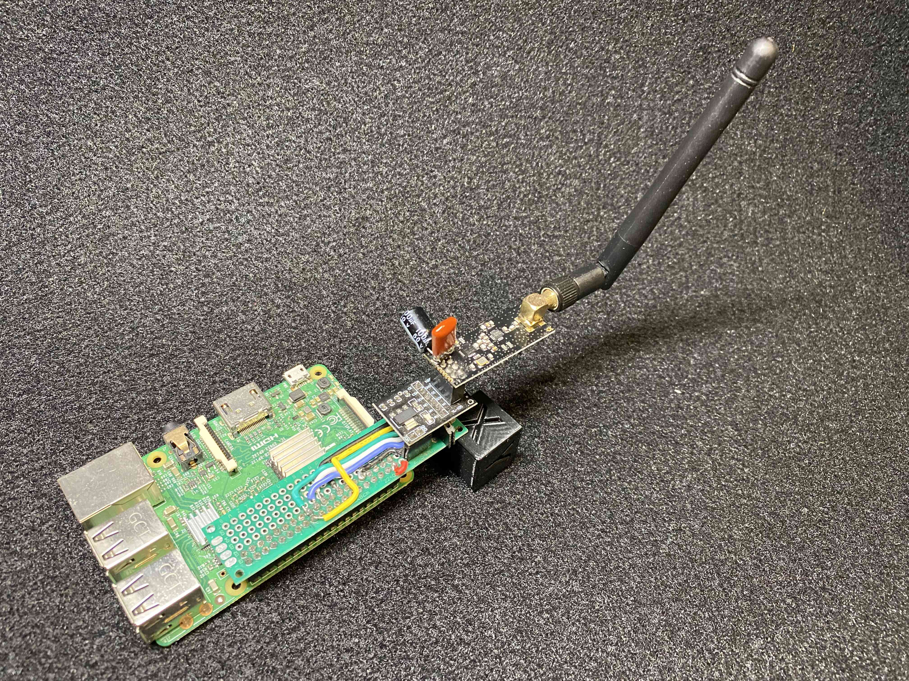
</p>
<p align="center"><em>Raspberry Pi controller with nRF24L01+ radio module</em></p>

| Keypad Node (Boot) | Keypad Node (Main Screen) |
|:------------------:|:-------------------------:|
| 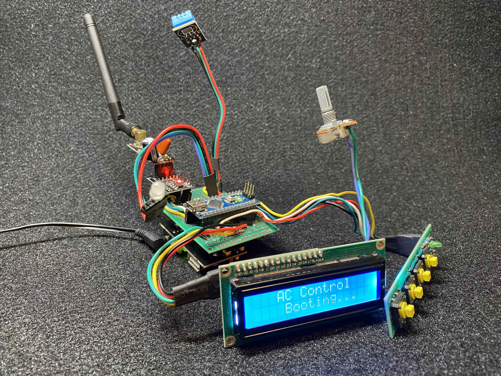 | 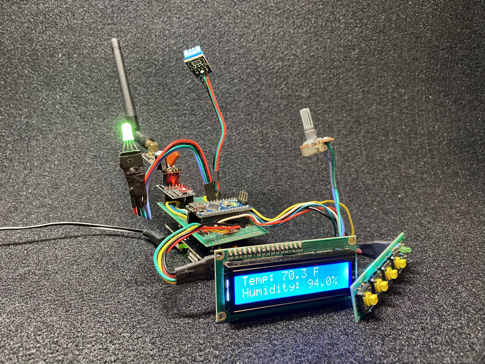 |

### Keypad Node Case

3D printed enclosure for the keypad node.

| Front (Outside) | Front (Inside) |
|:---------------:|:--------------:|
| 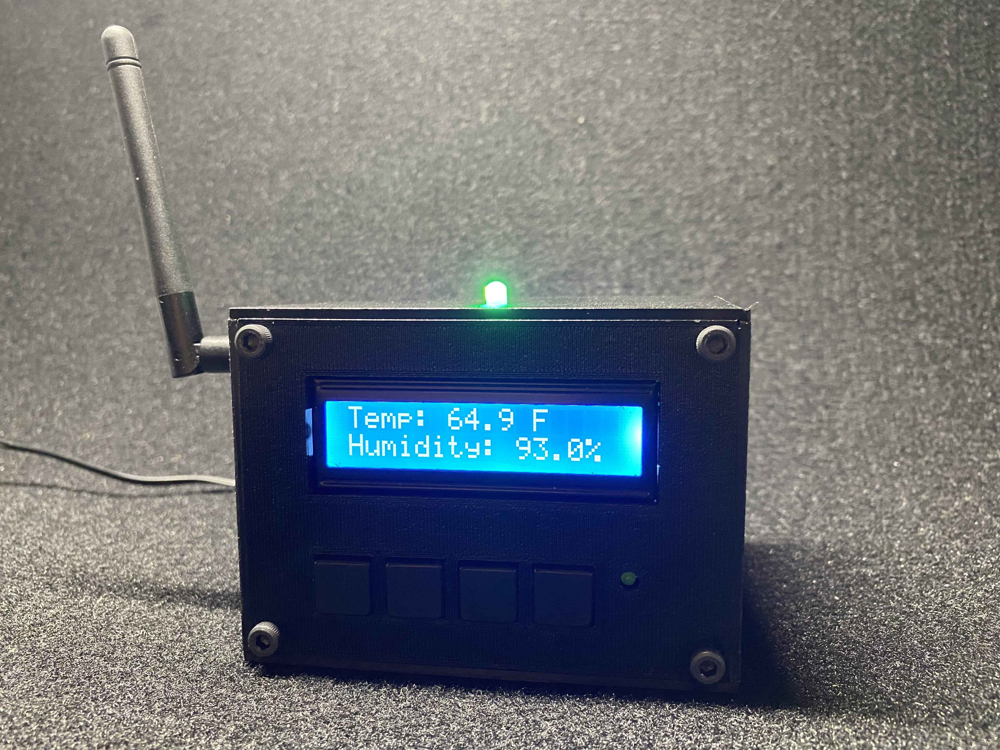 | 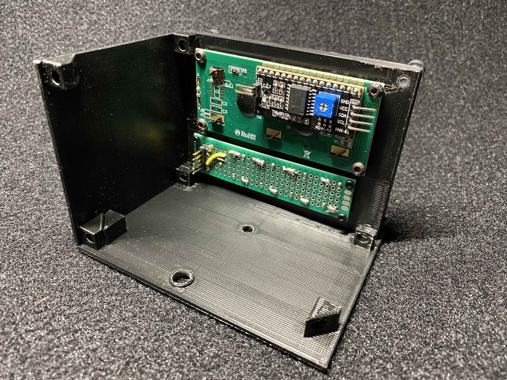 |

| Sensor Side (Outside) | Sensor Side (Inside) |
|:---------------------:|:--------------------:|
| 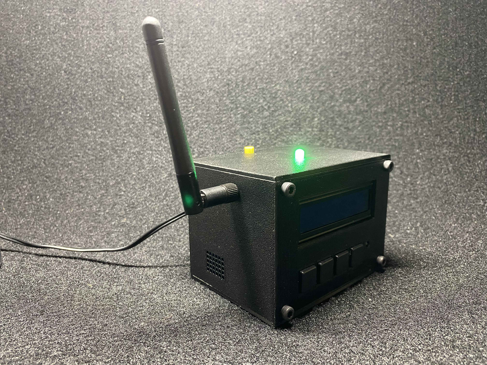 | 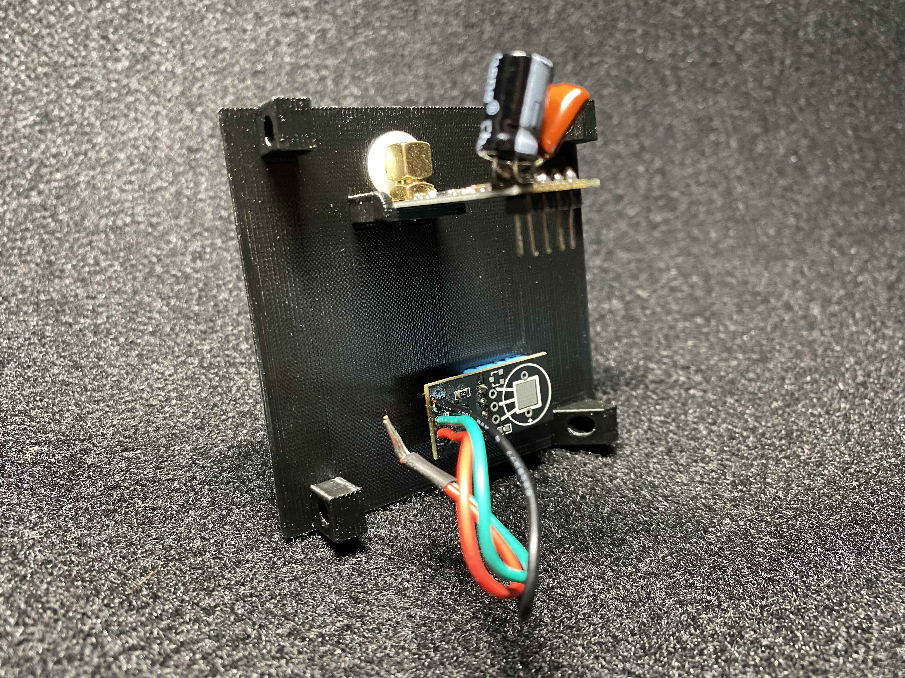 |

| Logic Board Side (Outside) | Logic Board Side (Inside) |
|:--------------------------:|:-------------------------:|
| 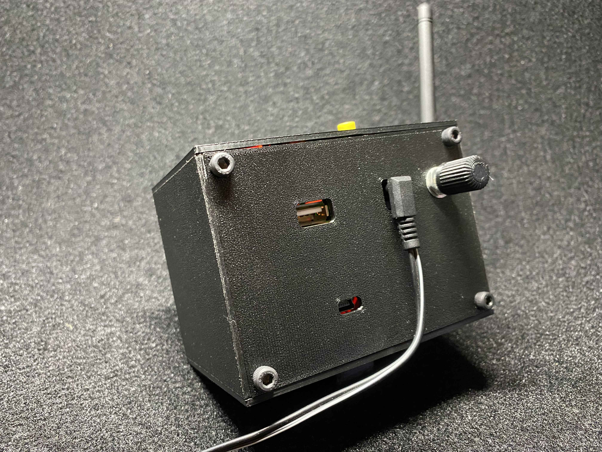 | 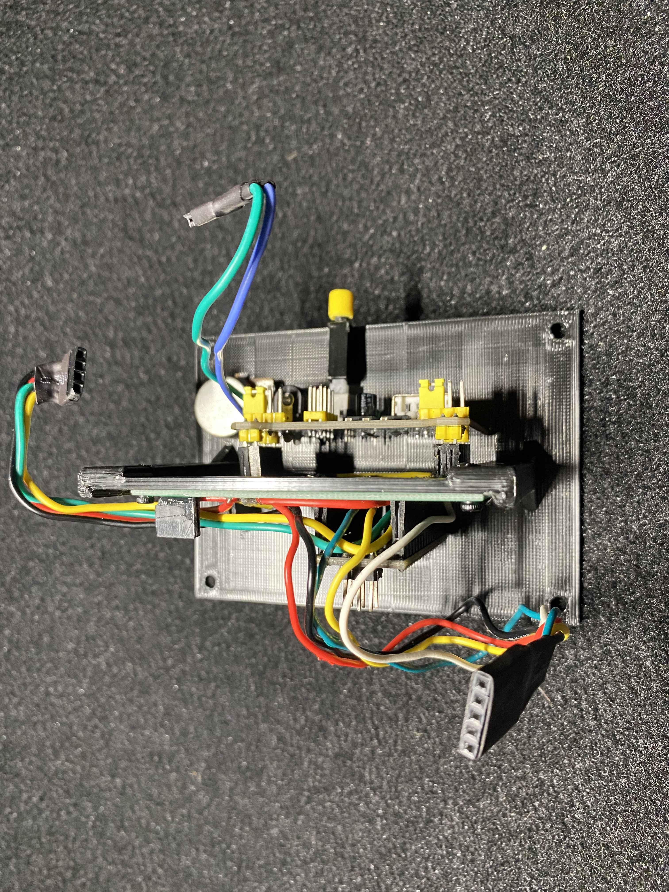 |

### Radio Module Capacitor Mod

The nRF24L01+ PA+LNA modules draw up to **115mA peak** during transmit at max power. This causes voltage sag that disrupts the rapid packet exchanges required for mesh DHCP handshakes. Symptoms include unreliable initial connections (e.g., needing to touch the antenna to connect) even though normal operation works once established.

**Fix:** Add capacitors directly across the module's VCC and GND pins:

| Component | Value | Purpose                                                            |
|-----------|-------|--------------------------------------------------------------------|
| Electrolytic | **100µF** | Absorbs bulk current dips during TX bursts                         |
| Ceramic | **68nF (0.068µF)** | Filters high-frequency switching noise. Use up to 100nF capacitor. |

```
3.3V ──────┬─────────┬──────── nRF24L01+ VCC
           │         │
      ┌────┴──┐ ┌────┴──┐
      │100µF  │ │ 68nF  │
      │electro│ │ceramic│
      └────┬──┘ └────┬──┘
           │         │
GND ───────┴─────────┴──────── nRF24L01+ GND
```

- **Electrolytic:** long leg (+) to VCC, short leg (-) to GND
- **Ceramic:** no polarity
- Mount as close to the module pins as possible

<p align="center">
  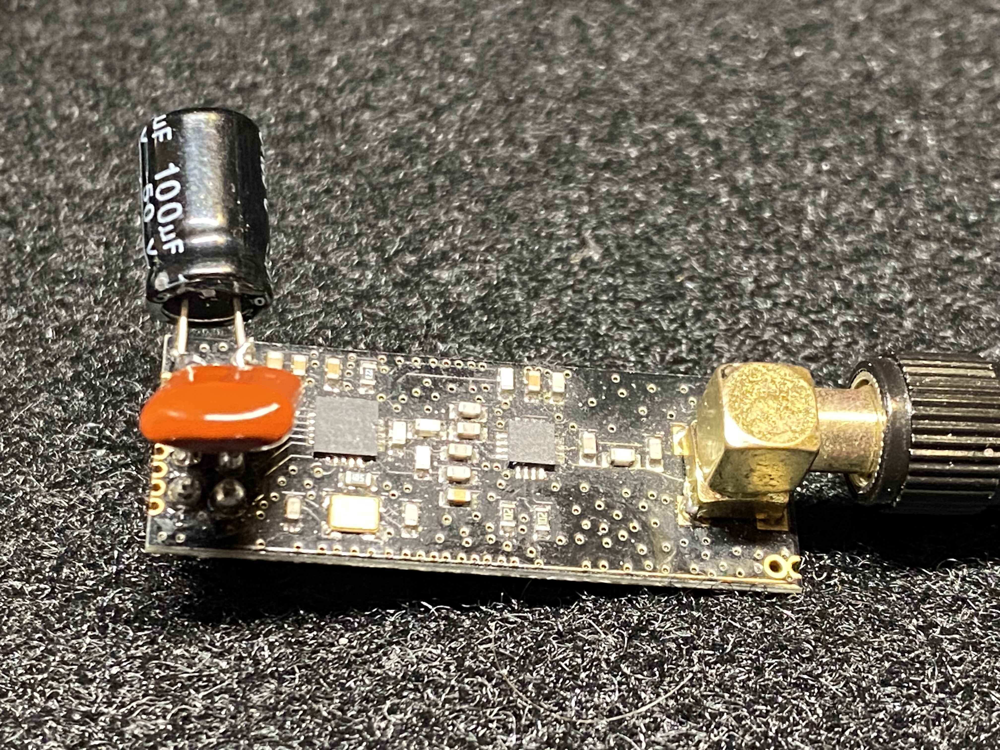
</p>

## Architecture

```
                        Raspberry Pi (Node 0)
               ┌──────────────────────────────────┐
               │  controller.py                   │
               │    Mesh controller + DB logger    │
               │                                   │
               │  socket_server.py                 │
               │    TCP server (localhost:65432)    │
               ├──────────────────────────────────┤
               │  mobileConsole.py                 │
               │    Interactive CLI client         │
               └──────┬──────────────────┬─────────┘
                      │  nRF24L01+ Mesh  │
                      │  Channel 97      │
            ┌─────────┴───┐         ┌────┴──────────┐
            │  Arduino    │         │  Arduino      │
            │  Node 1     │         │  Node 2       │
            │             │         │               │
            │  AC Relay   │         │  DHT11 Sensor │
            │  Interface  │         │  16x2 LCD     │
            │             │         │  4-btn Keypad  │
            │             │         │  RGB LED      │
            └─────────────┘         └───────────────┘
```

The controller manages all communication between nodes, logs AC state changes to PostgreSQL, and exposes a socket interface for the interactive console client.

## Directory Structure

```
.
├── README.md
├── pi_controller/          Raspberry Pi software
│   ├── controller.py         Main server (runs 24/7)
│   ├── socket_server.py      TCP socket module (imported by controller)
│   ├── mobileConsole.py      Interactive CLI client
│   ├── table.SQL             Database schema
│   ├── setup-pi.sh           System setup script
│   ├── api/                  FastAPI web server
│   │   ├── main.py             API entry point
│   │   ├── config.py           Environment configuration
│   │   ├── database.py         PostgreSQL helpers
│   │   ├── weather.py          Open-Meteo integration
│   │   ├── rates.py            Electricity rate calculations
│   │   ├── socket_client.py    Controller socket interface
│   │   └── routers/            API route handlers
│   └── web/                  Vue 3 dashboard
│       ├── src/                Source code
│       └── dist/               Production build
│
└── arduino_nodes/          Arduino firmware
    ├── AC_Interface/
    │   └── AC_Interface.ino  Node 1: AC relay controller
    └── keypadLCD/
        └── keypadLCD.ino     Node 2: Temp sensor + LCD + keypad
```

## Mesh Network

| Node | Device | Role |
|------|--------|------|
| 0 | Raspberry Pi 3 | Controller, database, socket server |
| 1 | Arduino Nano | AC relay switching |
| 2 | Arduino Nano | Temperature/humidity sensor, LCD display, keypad input |

All nodes communicate through Node 0 using [RF24Mesh](https://nrf24.github.io/RF24Mesh/) on channel 97 at 1 Mbps with maximum transmit power.

## Compact Packet Protocol

All mesh communication uses a compact key-value format designed to fit within the 32-byte RF24 payload limit.

**Format:** `key1value1,key2value2,...` (single-character keys, no delimiters between key and value)

| Key | Meaning | Example | Direction |
|-----|---------|---------|-----------|
| `s` | Sync request | `s1` | Node 2 &rarr; Controller |
| `t` | Temperature (&deg;F) | `t62.5` | Node 2 &rarr; Controller |
| `h` | Humidity (%) | `h45.2` | Node 2 &rarr; Controller |
| `x` | Max temp threshold | `x78` | Both directions |
| `n` | Min temp threshold | `n66` | Both directions |
| `a` | AC state (1=on, 0=off) | `a1` | Both directions |
| `l` | AC allowed (1=yes, 0=no) | `l1` | Controller &rarr; Node 2 |
| `b` | LED brightness (0-100) | `b75` | Controller &rarr; Node 2 |
| `k` | Heartbeat | `k1` | Both directions |
| `q` | Query state | `q1` | Node 1 &rarr; Controller |
| `r` | Reset node | `r1` | Controller &rarr; Node 1 |
| `g` | Toggle AC permission | `g1` | Node 2 &rarr; Controller |

**Examples:**
- `t62.5,h45.2` -- Temperature 62.5&deg;F, humidity 45.2% (heartbeat from Node 2)
- `x78,n66,a1,l1` -- Settings sync from controller to Node 2
- `a0` -- Turn AC off / report AC is off

## Quick Start

### Prerequisites

- Raspberry Pi with nRF24L01+ module connected via SPI
- Fresh Raspberry Pi OS installation

### Automated Setup

The setup script installs all dependencies, configures the database, builds the web dashboard, and sets up systemd services:

```bash
cd pi_controller
chmod +x setup-pi.sh
./setup-pi.sh
```

After setup completes, edit the API configuration:

```bash
nano pi_controller/api/.env
```

Then reboot:

```bash
sudo reboot
```

The system will start automatically. Access the dashboard at `http://<pi-hostname>/`

### Manual Running (Development)

Start the controller:

```bash
cd pi_controller
source .venv/bin/activate
python3 controller.py
```

Connect with the interactive console:

```bash
python3 mobileConsole.py
```

### Arduino Nodes

Open the `.ino` files in Arduino IDE, install the [required libraries](arduino_nodes/), select your board, and upload.

## Web Dashboard

A modern web interface for monitoring and controlling the AC system remotely.

<p align="center">
  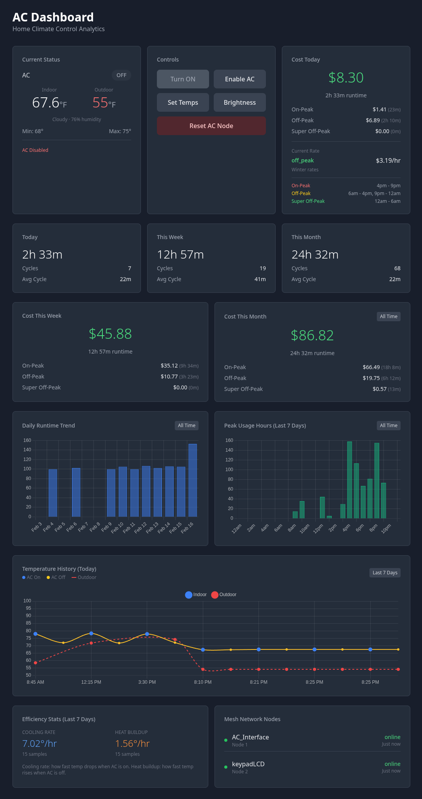
</p>

### Features

- Real-time temperature display and AC status
- Temperature history charts (today and weekly)
- Outdoor weather from Open-Meteo API
- Runtime statistics (daily, weekly, monthly, all-time)
- Electricity cost tracking with TOU rate periods
- Peak usage analysis by hour
- Control buttons for AC power, permission, and thresholds

### Configuration

Copy the example environment file and fill in your values:

```bash
cd pi_controller/api
cp .env.example .env
```

Edit `.env` with your settings:

| Variable | Example | Description |
|----------|---------|-------------|
| `DB_HOST` | `localhost` | PostgreSQL host |
| `DB_NAME` | `postgres` | Database name |
| `DB_USER` | `postgres` | Database user |
| `DB_PASSWORD` | `your_password` | Database password |
| `DB_PORT` | `5432` | PostgreSQL port |
| `LATITUDE` | `37.3348` | Location latitude (for weather) |
| `LONGITUDE` | `-122.0086` | Location longitude |
| `TIMEZONE` | `America/Los_Angeles` | Local timezone |
| `AC_WATTS` | `5000` | AC unit power consumption (watts) |
| `SUMMER_ON_PEAK` | `0.57614` | Summer on-peak rate ($/kWh) |
| `SUMMER_OFF_PEAK` | `0.51719` | Summer off-peak rate |
| `SUMMER_SUPER_OFF_PEAK` | `0.46163` | Summer super off-peak rate |
| `WINTER_ON_PEAK` | `0.62177` | Winter on-peak rate |
| `WINTER_OFF_PEAK` | `0.54003` | Winter off-peak rate |
| `WINTER_SUPER_OFF_PEAK` | `0.44924` | Winter super off-peak rate |

### Building the Frontend

```bash
cd pi_controller/web
npm install
npm run build
```

The production build will be in `dist/`.

### Running

**Development mode** (separate servers):

```bash
# Terminal 1: API server
cd pi_controller
PYTHONPATH=. .venv/bin/uvicorn api.main:app --reload --host 0.0.0.0 --port 8000

# Terminal 2: Frontend dev server
cd pi_controller/web
npm run dev
```

**Production mode** (nginx + uvicorn):

The `setup-pi.sh` script configures nginx to serve the Vue build and proxy API requests to uvicorn. It also creates systemd services for automatic startup.

```bash
# Services start automatically after setup, or manually:
sudo systemctl start ac-controller  # Mesh network controller
sudo systemctl start ac-api         # FastAPI server
sudo systemctl start nginx          # Web server

# View logs
journalctl -u ac-api -f
journalctl -u ac-controller -f
```

Access the dashboard at `http://<pi-hostname>/`

### API Endpoints

| Endpoint | Method | Description |
|----------|--------|-------------|
| `/ac/status` | GET | Current AC state and temperature |
| `/ac/live` | GET | Live status for polling |
| `/ac/settings` | GET | Temperature thresholds and permissions |
| `/ac/nodes` | GET | Mesh node status |
| `/ac/power/on` | POST | Turn AC on |
| `/ac/power/off` | POST | Turn AC off |
| `/ac/thresholds` | POST | Set min/max temperature |
| `/ac/permission/toggle` | POST | Toggle AC permission flag |
| `/ac/brightness` | POST | Set LED brightness |
| `/ac/reset` | POST | Reset AC node |
| `/analytics/summary` | GET | All analytics data |

### Dependencies

**API (Python):**
- `fastapi` - Web framework
- `uvicorn` - ASGI server
- `psycopg2-binary` - PostgreSQL driver
- `httpx` - Async HTTP client (weather API)
- `python-dotenv` - Environment file loading

**Frontend (Node.js):**
- Vue 3 + TypeScript
- Vite (build tool)
- Tailwind CSS
- Chart.js + vue-chartjs

## Safety Features

- **Temperature timeout** -- AC shuts off automatically if no temperature data is received for 3 minutes
- **AC permission flag** -- Global enable/disable prevents unintended AC operation; persisted in database
- **Stale state detection** -- Database entries older than 40 minutes are treated as stale; AC defaults to off
- **Mesh retries** -- All sends retry up to 3 times with 250ms delays
- **Node health checks** -- Controller pings nodes every 60 seconds and tracks online/offline status

## Further Reading

- [`pi_controller/`](pi_controller/) -- Server software details, database schema, socket protocol
- [`arduino_nodes/`](arduino_nodes/) -- Hardware wiring, firmware details, required libraries


